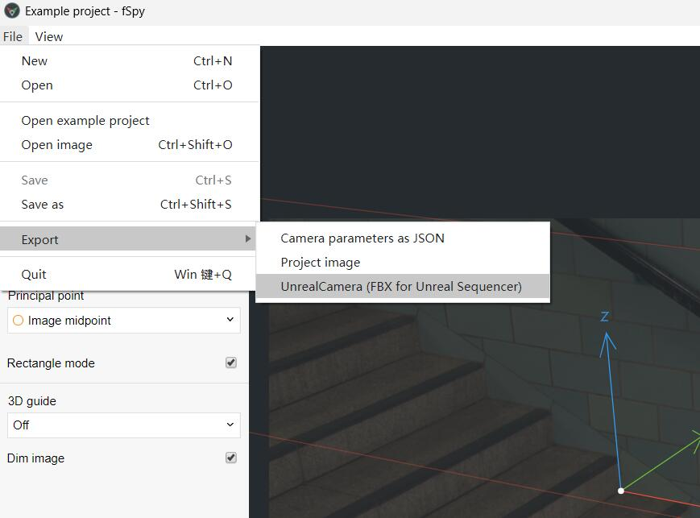

# fSpy (Unreal FBX Export)

## 中文

这是基于官方 fSpy（stuffmatic/fSpy）的小幅扩展版本，相比原版新增了面向 Unreal Engine 的相机 FBX 导出能力，其它工作流保持不变。

- 新增导出菜单项：`File -> Export -> UnrealCamera (FBX for Unreal Sequencer)`
- 新增导出格式：生成可被 Unreal Engine（Sequencer 的 FBX 导入流程）识别的相机 FBX
- 导出内容包含：相机位置/旋转（Transform）与基础镜头参数（FoV、Filmback/Sensor、Focal Length），并尽量保留主点偏移（Film Offset）
- 为适配 Sequencer：导出包含简单时间线（0–1 秒恒定关键帧），避免导入后轨道为空
- 坐标系对齐：导出 Transform 已按 UE 默认世界坐标（X Forward / Y Right / Z Up）对齐
- 为提升兼容性：导出时优先生成二进制 FBX；若缺少转换器则回退导出 ASCII FBX 并提示
- 默认命名：`FSpyCam_<ProjectName>_Unreal.fbx`

## English

This is a small extension fork of the official fSpy (stuffmatic/fSpy). Compared to upstream, it adds an Unreal Engine camera FBX export option while keeping the rest of the workflow unchanged.

- Added export menu item: `File -> Export -> UnrealCamera (FBX for Unreal Sequencer)`
- Added export format: writes a camera FBX that Unreal Engine can import via the Sequencer FBX import workflow
- Export includes: camera transform (position/rotation) and core lens parameters (FoV, filmback/sensor, focal length), with best-effort principal point mapping (film offset)
- Sequencer-friendly: includes a simple timeline (constant keys from 0–1s) so tracks are not empty after import
- Axis mapping: exported transforms are aligned to Unreal’s default world axes (X Forward / Y Right / Z Up)
- For compatibility: exports binary FBX when a converter is available; falls back to ASCII FBX (with a warning) when it is not
- Default naming: `FSpyCam_<ProjectName>_Unreal.fbx`

